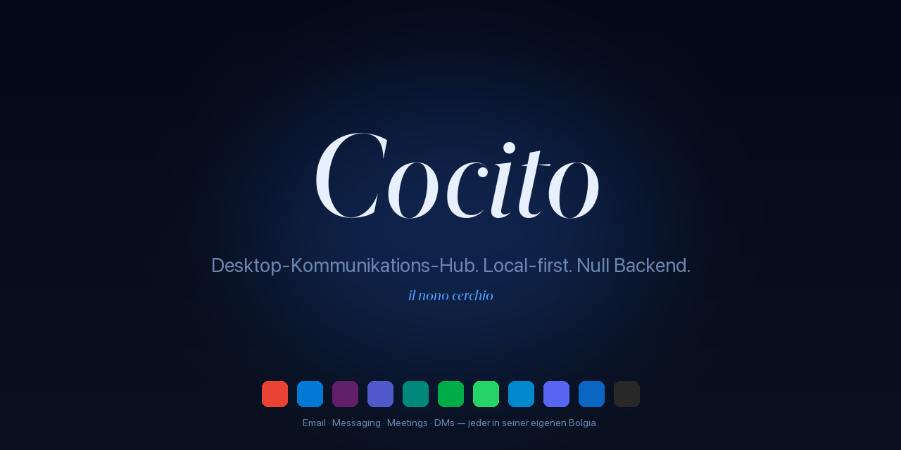

<div align="center">



<sub>
  <a href="README.md">🇵🇹 Português</a> ·
  <a href="README.en.md">🇬🇧 English</a> ·
  <a href="README.es.md">🇪🇸 Español</a> ·
  <a href="README.it.md">🇮🇹 Italiano</a> ·
  <a href="README.fr.md">🇫🇷 Français</a> ·
  🇩🇪 <strong>Deutsch</strong> ·
  <a href="README.ru.md">🇷🇺 Русский</a> ·
  <a href="README.la.md">🏛️ Latina</a>
</sub>

<h3><em>Desktop-Kommunikations-Hub. Local-first. Null Backend.</em></h3>

<p>
  <em>Cocito è il nono cerchio dell'Inferno — der gefrorene See, in dem alle Verräter zusammenkommen. Hier, wo alle Gespräche zusammenkommen.</em>
</p>

<p>
  <a href="https://github.com/fagnercandido/cocito/releases/latest"></a>
  <a href="LICENSE"></a>
  
  
</p>

</div>

---

## Was es ist

**Cocito** ist ein Desktop-Client, der **E-Mail + Messaging + Meetings** an einem Ort vereint. Jeder Dienst läuft in einer **isolierten nativen WebView** — Login über die UI des Anbieters, Cookies und Storage kreuzen sich nie. Kein von der App verwaltetes OAuth, keine APIs, keine Cloud, kein Konto.

Die Idee in drei Zeilen:

- **Kein Cocito-Backend.** Jedes *Device* ist eine Insel. Keine Synchronisation zwischen Maschinen.
- **Keine E-Mail-API.** Gmail ist Gmail in der WebView, mit deiner echten Sitzung.
- **Keine Cloud-KI.** Die KI-Assistentin (Beatriz) spricht nur mit **lokalem Ollama** in deinem LAN.

<div align="center">
  
  <br/>
  <sub><em>Sidebar mit 6 Diensten — Gmail (aktiv), zwei isolierte Slacks, WhatsApp mit 12 ungelesenen Nachrichten, Meet, LinkedIn. Jeder in seiner eigenen <strong>Bolgia</strong>.</em></sub>
</div>

---

## Highlights

| | |
|---|---|
| 🔒 **WebView-only** | Login auf der Anbieter-UI, echte Sitzung. Null von der App verwaltetes OAuth. |
| 🧊 **Isolierte Bolgias** | Eine `partition` pro Instanz (Malebolge). Persönlicher Slack + Arbeits-Slack nebeneinander, **null Kontamination**. |
| 🔔 **Native Benachrichtigungen** | Cérbero fängt die Web Notification API universell ab — funktioniert in Slack, Gmail, WhatsApp, ohne DOM-Scraping. |
| 🎨 **9 Themes × 2 Modi × 3 Typografien** | 54 Kombinationen, alle in Echtzeit, null Reload. Stacks Sober · Literarisch · Nativ, self-hosted Schriften. |
| 🤖 **Beatriz (lokale KI)** | `⌘K` für Gespräche mit deinem Ollama. HTTP-Streaming, optionaler Virgílio-Kontext. **Nichts verlässt das LAN.** |
| 🔍 **Virgílio** | SQLite + FTS5 über den Cérbero-Stream. `⌘⇧F` für Cross-Service-Suche. |
| 📝 **Scriptorium → Obsidian** | `⌘⇧S` Zitat · `⌘⇧B` Breadcrumb · `⌘⇧P` Seiten-Archiv (PDF). Direkt in dein Vault. |
| ⚖️ **Minos** | Regel-Engine: Trigger × Aktionen über den Stream — silence, priority, Theme-Wechsel, save quote. Hot-Reload. |
| 🌐 **i18n · 28 Sprachen** | Babele global angewendet. PT, EN, ES, IT, FR, DE, ZH, JA, KO, AR, HI, … |

---

## Die 9 Themes

<div align="center">
  
</div>

Jedes reagiert auf das `prefers-color-scheme` des Systems. **Crepuscolo** ist light-first; die anderen sind dark-first; alle haben ihre entgegengesetzte Variante.

---

## Quick start

### macOS

```bash
# Lade die .dmg der neuesten Version herunter
open https://github.com/fagnercandido/cocito/releases/latest

# Erstes Öffnen — vorerst unsigniert, einfach:
xattr -dr com.apple.quarantine /Applications/Cocito.app
```

### Windows · Linux

`.msi` (Windows x64) und `.AppImage` (Linux x64) kommen, sobald die Release-Pipeline geschlossen ist. Bis dahin **aus dem Quellcode bauen**.

### Aus dem Quellcode bauen

```bash
git clone https://github.com/fagnercandido/cocito.git
cd cocito/cocito-tauri
pnpm install
pnpm tauri:dev          # Entwicklungsmodus
pnpm tauri:build        # erzeugt .dmg/.msi/.AppImage je nach Host
```

Voraussetzungen: **Node 20 LTS · pnpm · Rust stable · Tauri 2 toolchain**.

---

## Die 10 dantesken Module

Die Benennung ist verbindlich — jedes Stück erbt den Namen eines Bewohners des Inferno.

| Modul | Funktion | Schicht |
|---|---|---|
| **Caronte** | Lebenszyklus der WebViews — load, reload, logout, UA-Spoofing | Rust + React |
| **Malebolge** | Sitzungsisolation, eine Partition pro Dienst/Instanz | Rust |
| **Cérbero** | Event-driven Backbone — fängt `window.Notification` ab, normalisiert, veröffentlicht auf dem Bus | Rust + Init-Skript |
| **Minos** | Regel-Engine — Trigger × Aktionen über den Stream | Rust |
| **Virgílio** | SQLite + FTS5 Indexer mit `⌘⇧F` Palette | Rust (tauri-plugin-sql) |
| **Scriptorium** | `⌘⇧S/B/P`-Erfassung in Obsidian | Rust (fs + print-to-pdf) |
| **Beatriz** | KI-Overlay mit lokalem Ollama | Rust-Bridge + React |
| **Messo** | Ollama-Discovery im LAN via mDNS/Bonjour | Rust (tauri-plugin-mdns) |
| **Babele** | i18n in 28 Sprachen | TypeScript |
| **Purgatorio** | Vitest + Playwright | TypeScript |

> **Unsichtbarer Dante.** Der Name ist die Struktur, aber die UI ist still: keine Flammen, keine Dämonen, keine gotische Typografie. Das einzige Icon ist ein gefrorener See.

---

## Stack

- **Tauri 2** + **Rust stable** (Backend)
- **React 18** + **TypeScript 5** + **Vite 5** (Frontend)
- **Tailwind CSS 3** + CSS-Variablen (Design-System der 9 Themes)
- **Zustand** (State, ~1 KB) · **Lucide React** (Icons) · **Framer Motion** (Mikroanimationen)
- **Native OS-WebView**: WebKit (mac), WebView2 (Win), WebKitGTK (Linux)
- **KI**: Ollama via HTTP (LAN) — `qwen3:32b`, `llama3.2`, beliebiges lokales Modell
- **Distribution**: `.dmg` (universal arm64+x86_64), `.msi` x64, `.AppImage` x64. Null Electron, null gebündeltes Chromium, null App Stores.

---

## Philosophie

### Invarianten (nicht ohne neue Diskussion verhandeln)

1. **WebView-only.** E-Mail eingeschlossen. Keine APIs, kein von der App verwaltetes OAuth.
2. **Event-driven via Notification-API.** Kein DOM-Scraping pro Dienst.
3. **Null Backend.** Keine Cloud, kein Konto, keine Inhaltssynchronisation.
4. **Local-first.** Alles auf der Festplatte, pro Device.
5. **KI nur lokales Ollama.** Verboten: OpenAI, Anthropic, Google, Apple Intelligence, BYOK.
6. **Jeder Dienst isoliert.** Eine `partition` pro Instanz — Cookies kreuzen sich nie.
7. **Unsichtbarer Dante.** Der Name ist strukturell, die UI ist still.

### Non-Goals

Mobile · App-verwaltete OAuth-Flows · E-Mail-APIs (Gmail API, MS Graph, IMAP, SMTP) · Mac App Store · Cloud-KI · Cloud-Inhaltssynchronisation · Indizierung stiller Gespräche (keine Notif → kein Stream — das ist ein *Feature*).

---

## Roadmap

- [x] **MVP** · Scaffold + 9 Themes + Drag-Drop-Sidebar + Malebolge + Cérbero + Minos + Scriptorium + Virgílio
- [x] **v1.1** · Beatriz (Ollama-Streaming) · Messo (mDNS) · `⌘⇧F`-Palette · Parser-Packs · i18n · Cérbero v2
- [x] **v1.2** · Tray-Badge-Unreads · Loading State · Sync-Skeleton
- [x] **v0.3** · SQLCipher opt-in · Keychain · A11y · Audit-Log · Auto-Update
- [ ] **v1.3** · Code Signing + Notarization Apple Developer ID
- [ ] **v1.4** · Windows/Linux-Builds via GitHub Actions
- [ ] **v1.5** · Stilles Scriptorium-PDF via CDP (wartet auf Upstream-`wry`-PR)
- [ ] **v2.0** · Echter Sync-Transport (Syncthing-side · P2P+Automerge · Iroh — in Entscheidung)

---

## Beitragen

Issues und PRs willkommen. Vor dem Start:

1. Lies [`cocito-revival-plan.md`](cocito-revival-plan.md) — es ist das kanonische Dokument.
2. Module haben eine **verbindliche Benennung** (Caronte, Cérbero, Virgílio…). Wenn du die Funktion änderst, behalte den Namen.
3. Die **architektonischen Invarianten** sind zu verteidigen, nicht in einzelnen PRs zu diskutieren. Bei Uneinigkeit öffne ein *Design*-Issue.
4. **Tests**: `pnpm test` (Vitest) und `cargo test --manifest-path src-tauri/Cargo.toml` vor dem Einreichen.
5. **Commit-Stil**: kurzer Imperativ in PT-PT oder EN, keine Emojis in der Nachricht.

---

## Sicherheit

Sicherheits-Bug? Siehe [`SECURITY.md`](SECURITY.md) für den richtigen Kanal. **Öffne kein** öffentliches Issue, bevor es einen Patch gibt.

---

## Lizenz

[MIT](LICENSE) · © 2026 Fagner Cândido

<div align="center">
  <sub>
    <a href="https://github.com/fagnercandido">GitHub</a> ·
    <a href="https://pt.linkedin.com/in/fagner-souza-candido">LinkedIn</a>
  </sub>
</div>
