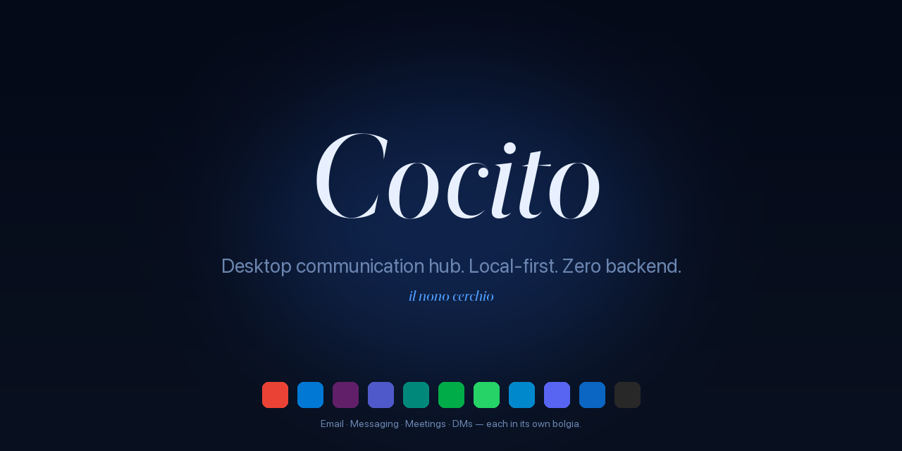

<div align="center">



<sub>
  <a href="README.md">🇵🇹 Português</a> ·
  🇬🇧 <strong>English</strong> ·
  <a href="README.es.md">🇪🇸 Español</a> ·
  <a href="README.it.md">🇮🇹 Italiano</a> ·
  <a href="README.fr.md">🇫🇷 Français</a> ·
  <a href="README.de.md">🇩🇪 Deutsch</a> ·
  <a href="README.ru.md">🇷🇺 Русский</a> ·
  <a href="README.la.md">🏛️ Latina</a>
</sub>

<h3><em>Desktop communication hub. Local-first. Zero backend.</em></h3>

<p>
  <em>Cocito è il nono cerchio dell'Inferno — the frozen lake where all traitors converge. Here, where all conversations converge.</em>
</p>

<p>
  <a href="https://github.com/fagnercandido/cocito/releases/latest"></a>
  <a href="LICENSE"></a>
  
  
</p>

</div>

---

## What it is

**Cocito** is a desktop client that brings **email + messaging + meetings** together in one place. Each service runs in an **isolated native WebView** — login through the provider's UI, cookies and storage never cross. No OAuth managed by the app, no APIs, no cloud, no account.

The idea in three lines:

- **No Cocito backend.** Each device is an island. No sync between machines.
- **No email API.** Gmail is Gmail inside the WebView, with your real session.
- **No cloud AI.** The AI assistant (Beatriz) only talks to **local Ollama** on your LAN.

<div align="center">
  
  <br/>
  <sub><em>Sidebar with 6 services — Gmail (active), two isolated Slacks, WhatsApp with 12 unreads, Meet, LinkedIn. Each in its own <strong>bolgia</strong>.</em></sub>
</div>

---

## Highlights

| | |
|---|---|
| 🔒 **WebView-only** | Login on the provider's UI, real session. Zero OAuth managed by the app. |
| 🧊 **Isolated bolgias** | One `partition` per instance (Malebolge). Personal Slack + work Slack side-by-side, **zero contamination**. |
| 🔔 **Native notifications** | Cérbero universally intercepts the Web Notification API — works on Slack, Gmail, WhatsApp, no DOM scraping. |
| 🎨 **9 themes × 2 modes × 3 typographies** | 54 combinations, all real-time, zero reload. Sober · Literary · Native typography stacks, self-hosted fonts. |
| 🤖 **Beatriz (local AI)** | `⌘K` to chat with your Ollama. HTTP streaming, optional Virgílio context. **Nothing leaves the LAN.** |
| 🔍 **Virgílio** | SQLite + FTS5 over the Cérbero stream. `⌘⇧F` for cross-service search. |
| 📝 **Scriptorium → Obsidian** | `⌘⇧S` quote · `⌘⇧B` breadcrumb · `⌘⇧P` page archive (PDF). Straight to your vault. |
| ⚖️ **Minos** | Rule engine: triggers × actions over the stream — silence, priority, theme switch, save quote. Hot-reload. |
| 🌐 **i18n · 28 languages** | Babele applied globally. PT, EN, ES, IT, FR, DE, ZH, JA, KO, AR, HI, … |

---

## The 9 themes

<div align="center">
  
</div>

Each one responds to the system's `prefers-color-scheme`. **Crepuscolo** is light-first; the others are dark-first; all have their opposite variant.

---

## Quick start

### macOS

```bash
# Download the .dmg from the latest release
open https://github.com/fagnercandido/cocito/releases/latest

# First open — unsigned for now, just:
xattr -dr com.apple.quarantine /Applications/Cocito.app
```

### Windows · Linux

`.msi` (Windows x64) and `.AppImage` (Linux x64) will arrive once the release pipeline is wired. For now, **build from source**.

### Build from source

```bash
git clone https://github.com/fagnercandido/cocito.git
cd cocito/cocito-tauri
pnpm install
pnpm tauri:dev          # dev mode
pnpm tauri:build        # produces .dmg/.msi/.AppImage depending on host
```

Prerequisites: **Node 20 LTS · pnpm · Rust stable · Tauri 2 toolchain**.

---

## The 10 Dantean modules

The naming is binding — each piece inherits the name of an inhabitant of Inferno.

| Module | Function | Layer |
|---|---|---|
| **Caronte** | WebView lifecycle — load, reload, logout, UA spoofing | Rust + React |
| **Malebolge** | Session isolation, one partition per service/instance | Rust |
| **Cérbero** | Event-driven backbone — intercepts `window.Notification`, normalizes, publishes on the bus | Rust + init-script |
| **Minos** | Rule engine — triggers × actions over the stream | Rust |
| **Virgílio** | SQLite + FTS5 indexer with `⌘⇧F` palette | Rust (tauri-plugin-sql) |
| **Scriptorium** | `⌘⇧S/B/P` capture into Obsidian | Rust (fs + print-to-pdf) |
| **Beatriz** | AI overlay with local Ollama | Rust bridge + React |
| **Messo** | Ollama discovery on LAN via mDNS/Bonjour | Rust (tauri-plugin-mdns) |
| **Babele** | i18n in 28 languages | TypeScript |
| **Purgatorio** | Vitest + Playwright | TypeScript |

> **Invisible Dante.** The naming is the structure, but the UI is silent: no flames, no demons, no gothic typography. The single icon is a frozen lake.

---

## Stack

- **Tauri 2** + **Rust stable** (backend)
- **React 18** + **TypeScript 5** + **Vite 5** (frontend)
- **Tailwind CSS 3** + CSS variables (9-themes design system)
- **Zustand** (state, ~1 KB) · **Lucide React** (icons) · **Framer Motion** (micro-animations)
- **OS native WebView**: WebKit (mac), WebView2 (Win), WebKitGTK (Linux)
- **AI**: Ollama via HTTP (LAN) — `qwen3:32b`, `llama3.2`, any local model
- **Distribution**: `.dmg` (universal arm64+x86_64), `.msi` x64, `.AppImage` x64. Zero Electron, zero bundled Chromium, zero app stores.

---

## Repo structure

```
cocito/
├── README.md                    ← this file (PT) + translations
├── LICENSE                      ← MIT
├── SECURITY.md                  ← security policy
├── cocito-revival-plan.md       ← canonical plan (full vision)
└── cocito-tauri/                ← the app
    ├── src-tauri/               ← Rust
    │   └── src/modules/         ← caronte · malebolge · cerbero · minos · virgilio · scriptorium · beatriz · messo
    ├── src/                     ← React
    │   ├── components/  themes/  typography/  fonts/  stores/  parsers/  locales/
    ├── init-scripts/            ← notification-intercept.js (universal, injected into every WebView)
    ├── services.json            ← service catalog
    └── scripts/                 ← release.sh, sign-and-notarize.sh, build-icon.py, build-readme-assets.py
```

At runtime, everything goes to `~/Library/Application Support/Cocito/` (mac), `%APPDATA%\Cocito\` (Win), `~/.config/Cocito/` (Linux).

---

## Philosophy

### Invariants (don't negotiate without fresh discussion)

1. **WebView-only.** Including email. No APIs, no app-managed OAuth.
2. **Event-driven via Notification API interception.** No per-service DOM scraping.
3. **Zero backend.** No cloud, no account, no content sync.
4. **Local-first.** Everything on disk, per device.
5. **AI only via local Ollama.** No OpenAI, Anthropic, Google, Apple Intelligence, BYOK.
6. **Each service isolated.** One `partition` per instance — cookies never cross.
7. **Invisible Dante.** The naming is structural, the UI is silent.

### Non-goals

Mobile · App-managed OAuth flows · Email APIs (Gmail API, MS Graph, IMAP, SMTP) · Mac App Store (sandbox blocks custom partitions) · Cloud AI · Cloud content sync · Indexing silent conversations (no notif → no stream — it's a *feature*).

---

## Roadmap

- [x] **MVP** · scaffold + 9 themes + drag-drop sidebar + Malebolge + Cérbero + Minos + Scriptorium + Virgílio
- [x] **v1.1** · Beatriz (Ollama streaming) · Messo (mDNS) · `⌘⇧F` palette · parser packs · i18n · Cérbero v2
- [x] **v1.2** · tray badge unreads · loading state · sync skeleton
- [x] **v0.3** · SQLCipher opt-in · keychain · A11y · audit log · auto-update
- [ ] **v1.3** · code signing + notarization Apple Developer ID
- [ ] **v1.4** · Windows/Linux builds via GitHub Actions
- [ ] **v1.5** · silent Scriptorium PDF via CDP (waits for upstream `wry` PR)
- [ ] **v2.0** · real sync transport (Syncthing-side · P2P+Automerge · Iroh — under decision)

---

## Contributing

Issues and PRs welcome. Before starting:

1. Read [`cocito-revival-plan.md`](cocito-revival-plan.md) — it's the canonical document.
2. Modules have **binding naming** (Caronte, Cérbero, Virgílio…). If you change the function, keep the name.
3. The **architectural invariants** are to be defended, not debated in stray PRs. If you disagree with one, open a *design* issue.
4. **Tests**: `pnpm test` (Vitest) and `cargo test --manifest-path src-tauri/Cargo.toml` before submitting.
5. **Commit style**: short imperative in PT-PT or EN, no emojis in the message.

---

## Security

Security bug? See [`SECURITY.md`](SECURITY.md) for the proper channel. **Don't** open a public issue until there's a patch.

---

## License

[MIT](LICENSE) · © 2026 Fagner Cândido

<div align="center">
  <sub>
    <a href="https://github.com/fagnercandido">GitHub</a> ·
    <a href="https://pt.linkedin.com/in/fagner-souza-candido">LinkedIn</a>
  </sub>
</div>
