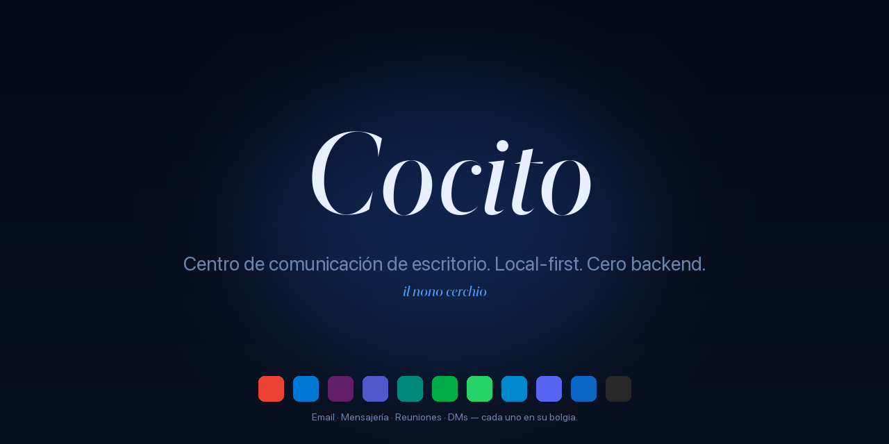

<div align="center">



<sub>
  <a href="README.md">🇵🇹 Português</a> ·
  <a href="README.en.md">🇬🇧 English</a> ·
  🇪🇸 <strong>Español</strong> ·
  <a href="README.it.md">🇮🇹 Italiano</a> ·
  <a href="README.fr.md">🇫🇷 Français</a> ·
  <a href="README.de.md">🇩🇪 Deutsch</a> ·
  <a href="README.ru.md">🇷🇺 Русский</a> ·
  <a href="README.la.md">🏛️ Latina</a>
</sub>

<h3><em>Centro de comunicación de escritorio. Local-first. Cero backend.</em></h3>

<p>
  <em>Cocito è il nono cerchio dell'Inferno — el lago helado donde convergen todos los traidores. Aquí, donde convergen todas las conversaciones.</em>
</p>

<p>
  <a href="https://github.com/fagnercandido/cocito/releases/latest"></a>
  <a href="LICENSE"></a>
  
  
</p>

</div>

---

## Qué es

**Cocito** es un cliente de escritorio que une **correo + mensajería + reuniones** en un solo lugar. Cada servicio corre en una **WebView nativa aislada** — login por la UI del proveedor, las cookies y el almacenamiento nunca se cruzan. Sin OAuth gestionado por la app, sin APIs, sin nube, sin cuenta.

La idea en tres líneas:

- **No hay backend de Cocito.** Cada *device* es una isla. Sin sincronización entre máquinas.
- **No hay API de correo.** Gmail es Gmail dentro de la WebView, con tu sesión real.
- **No hay IA en la nube.** La asistente IA (Beatriz) sólo habla con **Ollama local** en tu LAN.

<div align="center">
  
  <br/>
  <sub><em>Barra lateral con 6 servicios — Gmail (activo), dos Slacks aislados, WhatsApp con 12 sin leer, Meet, LinkedIn. Cada uno en su <strong>bolgia</strong>.</em></sub>
</div>

---

## Características

| | |
|---|---|
| 🔒 **WebView-only** | Login en la UI del proveedor, sesión real. Cero OAuth gestionado por la app. |
| 🧊 **Bolgias aisladas** | Una `partition` por instancia (Malebolge). Slack personal + Slack del trabajo lado a lado, **cero contaminación**. |
| 🔔 **Notificaciones nativas** | Cérbero intercepta universalmente la Web Notification API — funciona en Slack, Gmail, WhatsApp, sin scrape de DOM. |
| 🎨 **9 temas × 2 modos × 3 tipografías** | 54 combinaciones, todas en tiempo real, cero reload. Pilas Sobria · Literaria · Nativa, fuentes self-hosted. |
| 🤖 **Beatriz (IA local)** | `⌘K` para conversar con tu Ollama. Stream HTTP, contexto opcional de Virgílio. **Nada sale de la LAN.** |
| 🔍 **Virgílio** | SQLite + FTS5 sobre el stream de Cérbero. `⌘⇧F` para búsqueda cross-service. |
| 📝 **Scriptorium → Obsidian** | `⌘⇧S` cita · `⌘⇧B` breadcrumb · `⌘⇧P` archivo de página (PDF). Directo a tu vault. |
| ⚖️ **Minos** | Motor de reglas: gatillos × acciones sobre el stream — silenciar, prioridad, cambio de tema, guardar cita. Hot-reload. |
| 🌐 **i18n · 28 idiomas** | Babele aplicado globalmente. PT, EN, ES, IT, FR, DE, ZH, JA, KO, AR, HI, … |

---

## Los 9 temas

<div align="center">
  
</div>

Cada uno responde al `prefers-color-scheme` del sistema. **Crepuscolo** es light-first; los demás son dark-first; todos tienen su variante opuesta.

---

## Quick start

### macOS

```bash
# Descarga el .dmg de la última release
open https://github.com/fagnercandido/cocito/releases/latest

# Primera apertura — sin firmar por ahora, basta con:
xattr -dr com.apple.quarantine /Applications/Cocito.app
```

### Windows · Linux

`.msi` (Windows x64) y `.AppImage` (Linux x64) llegarán cuando el pipeline de release esté cerrado. Por ahora, **build desde el código fuente**.

### Build desde el código fuente

```bash
git clone https://github.com/fagnercandido/cocito.git
cd cocito/cocito-tauri
pnpm install
pnpm tauri:dev          # modo desarrollo
pnpm tauri:build        # produce .dmg/.msi/.AppImage según el host
```

Prerrequisitos: **Node 20 LTS · pnpm · Rust stable · Tauri 2 toolchain**.

---

## Los 10 módulos dantescos

La nomenclatura es vinculante — cada pieza hereda el nombre de un habitante del Infierno.

| Módulo | Función | Capa |
|---|---|---|
| **Caronte** | Ciclo de vida de las WebViews — load, reload, logout, UA spoofing | Rust + React |
| **Malebolge** | Aislamiento de sesiones, una partition por servicio/instancia | Rust |
| **Cérbero** | Backbone event-driven — intercepta `window.Notification`, normaliza, publica en el bus | Rust + init-script |
| **Minos** | Motor de reglas — gatillos × acciones sobre el stream | Rust |
| **Virgílio** | Indexador SQLite + FTS5 con paleta `⌘⇧F` | Rust (tauri-plugin-sql) |
| **Scriptorium** | Captura `⌘⇧S/B/P` para Obsidian | Rust (fs + print-to-pdf) |
| **Beatriz** | Overlay de IA con Ollama local | Rust bridge + React |
| **Messo** | Discovery de Ollama en LAN vía mDNS/Bonjour | Rust (tauri-plugin-mdns) |
| **Babele** | i18n en 28 idiomas | TypeScript |
| **Purgatorio** | Vitest + Playwright | TypeScript |

> **Dante invisible.** El nombre es la estructura, pero la UI es silenciosa: sin llamas, sin demonios, sin tipografía gótica. El único icono es un lago helado.

---

## Stack

- **Tauri 2** + **Rust stable** (backend)
- **React 18** + **TypeScript 5** + **Vite 5** (frontend)
- **Tailwind CSS 3** + CSS variables (sistema de diseño de los 9 temas)
- **Zustand** (estado, ~1 KB) · **Lucide React** (iconos) · **Framer Motion** (micro-animaciones)
- **WebView nativa del SO**: WebKit (mac), WebView2 (Win), WebKitGTK (Linux)
- **IA**: Ollama via HTTP (LAN) — `qwen3:32b`, `llama3.2`, cualquier modelo local
- **Distribución**: `.dmg` (universal arm64+x86_64), `.msi` x64, `.AppImage` x64. Cero Electron, cero Chromium empaquetado, cero app stores.

---

## Filosofía

### Invariantes (no negociar sin nueva discusión)

1. **WebView-only.** Correo incluido. Sin APIs, sin OAuth gestionado por la app.
2. **Event-driven vía Notification API.** Sin DOM scraping per-service.
3. **Cero backend.** Sin nube, sin cuenta, sin sync de contenido.
4. **Local-first.** Todo en disco, por *device*.
5. **IA sólo Ollama local.** Prohibido OpenAI, Anthropic, Google, Apple Intelligence, BYOK.
6. **Cada servicio aislado.** Una `partition` por instancia — cookies nunca cruzadas.
7. **Dante invisible.** El nombre es estructural, la UI es silenciosa.

### Non-goals

Móvil · OAuth gestionado por la app · Email APIs (Gmail API, MS Graph, IMAP, SMTP) · Mac App Store · IA en la nube · Sync de contenido en la nube · Indexar conversaciones silenciosas (sin notif → sin stream — es *feature*).

---

## Roadmap

- [x] **MVP** · scaffold + 9 temas + sidebar drag-drop + Malebolge + Cérbero + Minos + Scriptorium + Virgílio
- [x] **v1.1** · Beatriz (Ollama streaming) · Messo (mDNS) · paleta `⌘⇧F` · parser packs · i18n · Cérbero v2
- [x] **v1.2** · tray badge unreads · loading state · sync skeleton
- [x] **v0.3** · SQLCipher opt-in · keychain · A11y · audit log · auto-update
- [ ] **v1.3** · code signing + notarization Apple Developer ID
- [ ] **v1.4** · builds Windows/Linux via GitHub Actions
- [ ] **v1.5** · Scriptorium PDF silencioso vía CDP (espera PR upstream `wry`)
- [ ] **v2.0** · sync transport real (Syncthing-side · P2P+Automerge · Iroh — en decisión)

---

## Contribuir

Issues y PRs bienvenidos. Antes de empezar:

1. Lee [`cocito-revival-plan.md`](cocito-revival-plan.md) — es el documento canónico.
2. Los módulos tienen **nomenclatura vinculante** (Caronte, Cérbero, Virgílio…). Si tocas la función, mantén el nombre.
3. Los **invariantes arquitectónicos** son para defender, no para discutir en PRs sueltos. Si discrepas, abre una issue de *design*.
4. **Tests**: `pnpm test` (Vitest) y `cargo test --manifest-path src-tauri/Cargo.toml` antes de enviar.
5. **Estilo de commit**: imperativo corto en PT-PT o EN, sin emojis en el mensaje.

---

## Seguridad

¿Bug de seguridad? Mira [`SECURITY.md`](SECURITY.md) para el canal apropiado. **No** abras issue público hasta haber parche.

---

## Licencia

[MIT](LICENSE) · © 2026 Fagner Cândido

<div align="center">
  <sub>
    <a href="https://github.com/fagnercandido">GitHub</a> ·
    <a href="https://pt.linkedin.com/in/fagner-souza-candido">LinkedIn</a>
  </sub>
</div>
