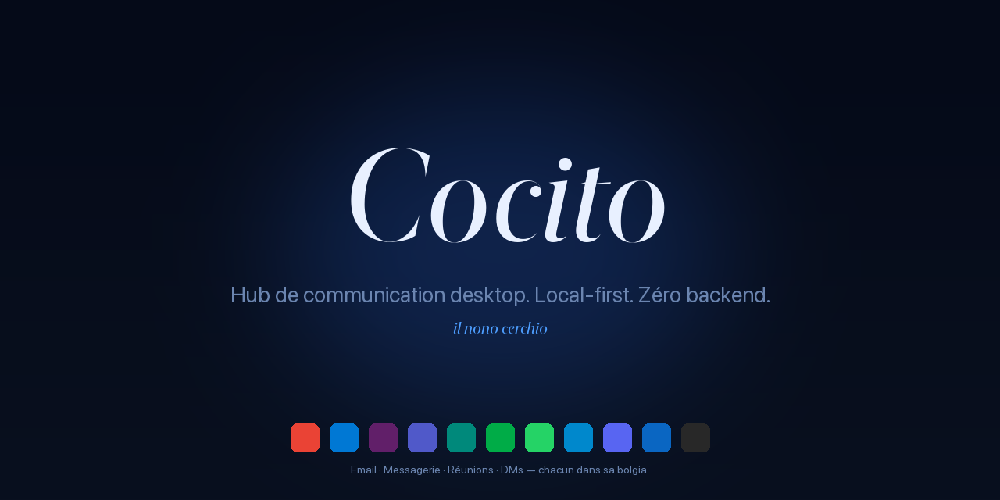

<div align="center">



<sub>
  <a href="README.md">🇵🇹 Português</a> ·
  <a href="README.en.md">🇬🇧 English</a> ·
  <a href="README.es.md">🇪🇸 Español</a> ·
  <a href="README.it.md">🇮🇹 Italiano</a> ·
  🇫🇷 <strong>Français</strong> ·
  <a href="README.de.md">🇩🇪 Deutsch</a> ·
  <a href="README.ru.md">🇷🇺 Русский</a> ·
  <a href="README.la.md">🏛️ Latina</a>
</sub>

<h3><em>Hub de communication desktop. Local-first. Zéro backend.</em></h3>

<p>
  <em>Cocito è il nono cerchio dell'Inferno — le lac glacé où convergent tous les traîtres. Ici, où convergent toutes les conversations.</em>
</p>

<p>
  <a href="https://github.com/fagnercandido/cocito/releases/latest"></a>
  <a href="LICENSE"></a>
  
  
</p>

</div>

---

## Qu'est-ce que c'est

**Cocito** est un client desktop qui réunit **email + messagerie + réunions** en un seul endroit. Chaque service tourne dans une **WebView native isolée** — login via l'UI du fournisseur, les cookies et le storage ne se croisent jamais. Pas d'OAuth géré par l'app, pas d'API, pas de cloud, pas de compte.

L'idée en trois lignes :

- **Pas de backend Cocito.** Chaque *device* est une île. Pas de sync entre machines.
- **Pas d'API email.** Gmail est Gmail dans la WebView, avec ta vraie session.
- **Pas d'IA cloud.** L'assistante IA (Beatriz) ne parle qu'à **Ollama local** sur ton LAN.

<div align="center">
  
  <br/>
  <sub><em>Sidebar avec 6 services — Gmail (actif), deux Slacks isolés, WhatsApp avec 12 non lus, Meet, LinkedIn. Chacun dans sa <strong>bolgia</strong>.</em></sub>
</div>

---

## Points forts

| | |
|---|---|
| 🔒 **WebView-only** | Login dans l'UI du fournisseur, vraie session. Zéro OAuth géré par l'app. |
| 🧊 **Bolgias isolées** | Une `partition` par instance (Malebolge). Slack perso + Slack pro côte à côte, **zéro contamination**. |
| 🔔 **Notifications natives** | Cérbero intercepte universellement la Web Notification API — fonctionne sur Slack, Gmail, WhatsApp, sans scrape DOM. |
| 🎨 **9 thèmes × 2 modes × 3 typographies** | 54 combinaisons, toutes en temps réel, zéro reload. Stacks Sobre · Littéraire · Native, polices self-hosted. |
| 🤖 **Beatriz (IA locale)** | `⌘K` pour discuter avec ton Ollama. Stream HTTP, contexte optionnel de Virgílio. **Rien ne sort du LAN.** |
| 🔍 **Virgílio** | SQLite + FTS5 sur le stream de Cérbero. `⌘⇧F` pour la recherche cross-service. |
| 📝 **Scriptorium → Obsidian** | `⌘⇧S` citation · `⌘⇧B` breadcrumb · `⌘⇧P` archive de page (PDF). Direct vers ton vault. |
| ⚖️ **Minos** | Moteur de règles : déclencheurs × actions sur le stream — silence, priorité, changement de thème, save quote. Hot-reload. |
| 🌐 **i18n · 28 langues** | Babele appliqué globalement. PT, EN, ES, IT, FR, DE, ZH, JA, KO, AR, HI, … |

---

## Les 9 thèmes

<div align="center">
  
</div>

Chacun répond au `prefers-color-scheme` du système. **Crepuscolo** est light-first ; les autres sont dark-first ; tous ont leur variante opposée.

---

## Quick start

### macOS

```bash
# Télécharge le .dmg de la dernière release
open https://github.com/fagnercandido/cocito/releases/latest

# Première ouverture — non signé pour l'instant, il suffit de :
xattr -dr com.apple.quarantine /Applications/Cocito.app
```

### Windows · Linux

`.msi` (Windows x64) et `.AppImage` (Linux x64) arriveront quand le pipeline de release sera bouclé. En attendant, **build depuis les sources**.

### Build depuis les sources

```bash
git clone https://github.com/fagnercandido/cocito.git
cd cocito/cocito-tauri
pnpm install
pnpm tauri:dev          # mode dev
pnpm tauri:build        # produit .dmg/.msi/.AppImage selon l'hôte
```

Prérequis : **Node 20 LTS · pnpm · Rust stable · Tauri 2 toolchain**.

---

## Les 10 modules dantesques

La nomenclature est contraignante — chaque pièce hérite du nom d'un habitant de l'Inferno.

| Module | Fonction | Couche |
|---|---|---|
| **Caronte** | Cycle de vie des WebViews — load, reload, logout, UA spoofing | Rust + React |
| **Malebolge** | Isolement des sessions, une partition par service/instance | Rust |
| **Cérbero** | Backbone event-driven — intercepte `window.Notification`, normalise, publie sur le bus | Rust + init-script |
| **Minos** | Moteur de règles — déclencheurs × actions sur le stream | Rust |
| **Virgílio** | Indexeur SQLite + FTS5 avec palette `⌘⇧F` | Rust (tauri-plugin-sql) |
| **Scriptorium** | Capture `⌘⇧S/B/P` vers Obsidian | Rust (fs + print-to-pdf) |
| **Beatriz** | Overlay IA avec Ollama local | Rust bridge + React |
| **Messo** | Discovery d'Ollama sur LAN via mDNS/Bonjour | Rust (tauri-plugin-mdns) |
| **Babele** | i18n en 28 langues | TypeScript |
| **Purgatorio** | Vitest + Playwright | TypeScript |

> **Dante invisible.** Le nom est la structure, mais l'UI est silencieuse : pas de flammes, pas de démons, pas de typographie gothique. L'unique icône est un lac glacé.

---

## Stack

- **Tauri 2** + **Rust stable** (backend)
- **React 18** + **TypeScript 5** + **Vite 5** (frontend)
- **Tailwind CSS 3** + variables CSS (design system des 9 thèmes)
- **Zustand** (state, ~1 KB) · **Lucide React** (icônes) · **Framer Motion** (micro-animations)
- **WebView native de l'OS** : WebKit (mac), WebView2 (Win), WebKitGTK (Linux)
- **IA** : Ollama via HTTP (LAN) — `qwen3:32b`, `llama3.2`, n'importe quel modèle local
- **Distribution** : `.dmg` (universel arm64+x86_64), `.msi` x64, `.AppImage` x64. Zéro Electron, zéro Chromium embarqué, zéro app store.

---

## Philosophie

### Invariants (ne pas négocier sans nouvelle discussion)

1. **WebView-only.** Email inclus. Pas d'API, pas d'OAuth géré par l'app.
2. **Event-driven via Notification API.** Pas de DOM scraping par service.
3. **Zéro backend.** Pas de cloud, pas de compte, pas de sync de contenu.
4. **Local-first.** Tout sur disque, par *device*.
5. **IA uniquement Ollama local.** Interdit : OpenAI, Anthropic, Google, Apple Intelligence, BYOK.
6. **Chaque service isolé.** Une `partition` par instance — cookies jamais croisés.
7. **Dante invisible.** Le nom est structurel, l'UI est silencieuse.

### Non-objectifs

Mobile · Flux OAuth gérés par l'app · APIs email (Gmail API, MS Graph, IMAP, SMTP) · Mac App Store · IA cloud · Sync de contenu cloud · Indexer les conversations silencieuses (pas de notif → pas de stream — c'est une *feature*).

---

## Roadmap

- [x] **MVP** · scaffold + 9 thèmes + sidebar drag-drop + Malebolge + Cérbero + Minos + Scriptorium + Virgílio
- [x] **v1.1** · Beatriz (Ollama streaming) · Messo (mDNS) · palette `⌘⇧F` · parser packs · i18n · Cérbero v2
- [x] **v1.2** · tray badge unreads · loading state · sync skeleton
- [x] **v0.3** · SQLCipher opt-in · keychain · A11y · audit log · auto-update
- [ ] **v1.3** · code signing + notarization Apple Developer ID
- [ ] **v1.4** · builds Windows/Linux via GitHub Actions
- [ ] **v1.5** · Scriptorium PDF silencieux via CDP (attend PR upstream `wry`)
- [ ] **v2.0** · transport sync réel (Syncthing-side · P2P+Automerge · Iroh — en décision)

---

## Contribuer

Issues et PRs bienvenus. Avant de commencer :

1. Lis [`cocito-revival-plan.md`](cocito-revival-plan.md) — c'est le document canonique.
2. Les modules ont une **nomenclature contraignante** (Caronte, Cérbero, Virgílio…). Si tu changes la fonction, garde le nom.
3. Les **invariants architecturaux** sont à défendre, pas à discuter dans des PRs isolés. En cas de désaccord, ouvre une issue *design*.
4. **Tests** : `pnpm test` (Vitest) et `cargo test --manifest-path src-tauri/Cargo.toml` avant d'envoyer.
5. **Style de commit** : impératif court en PT-PT ou EN, pas d'emojis dans le message.

---

## Sécurité

Bug de sécurité ? Vois [`SECURITY.md`](SECURITY.md) pour le canal approprié. **N'ouvre pas** d'issue publique avant qu'il y ait un patch.

---

## Licence

[MIT](LICENSE) · © 2026 Fagner Cândido

<div align="center">
  <sub>
    <a href="https://github.com/fagnercandido">GitHub</a> ·
    <a href="https://pt.linkedin.com/in/fagner-souza-candido">LinkedIn</a>
  </sub>
</div>
