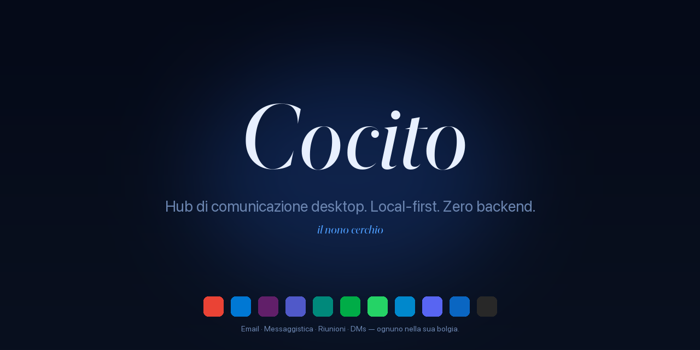

<div align="center">



<sub>
  <a href="README.md">🇵🇹 Português</a> ·
  <a href="README.en.md">🇬🇧 English</a> ·
  <a href="README.es.md">🇪🇸 Español</a> ·
  🇮🇹 <strong>Italiano</strong> ·
  <a href="README.fr.md">🇫🇷 Français</a> ·
  <a href="README.de.md">🇩🇪 Deutsch</a> ·
  <a href="README.ru.md">🇷🇺 Русский</a> ·
  <a href="README.la.md">🏛️ Latina</a>
</sub>

<h3><em>Hub di comunicazione desktop. Local-first. Zero backend.</em></h3>

<p>
  <em>Cocito è il nono cerchio dell'Inferno — il lago ghiacciato dove convergono tutti i traditori. Qui, dove convergono tutte le conversazioni.</em>
</p>

<p>
  <a href="https://github.com/fagnercandido/cocito/releases/latest"></a>
  <a href="LICENSE"></a>
  
  
</p>

</div>

---

## Cos'è

**Cocito** è un client desktop che riunisce **email + messaggistica + riunioni** in un unico posto. Ogni servizio gira in una **WebView nativa isolata** — login dall'UI del provider, cookie e storage non si incrociano mai. Niente OAuth gestito dall'app, niente API, niente cloud, niente account.

L'idea in tre righe:

- **Niente backend Cocito.** Ogni *device* è un'isola. Niente sync tra macchine.
- **Niente API email.** Gmail è Gmail dentro la WebView, con la tua sessione vera.
- **Niente AI cloud.** L'assistente AI (Beatrice) parla solo con **Ollama locale** sulla tua LAN.

<div align="center">
  
  <br/>
  <sub><em>Sidebar con 6 servizi — Gmail (attivo), due Slack isolati, WhatsApp con 12 non letti, Meet, LinkedIn. Ognuno nella sua <strong>bolgia</strong>.</em></sub>
</div>

---

## Punti di forza

| | |
|---|---|
| 🔒 **Solo WebView** | Login sull'UI del provider, sessione vera. Zero OAuth gestito dall'app. |
| 🧊 **Bolge isolate** | Una `partition` per istanza (Malebolge). Slack personale + Slack di lavoro fianco a fianco, **zero contaminazione**. |
| 🔔 **Notifiche native** | Cerbero intercetta universalmente la Web Notification API — funziona su Slack, Gmail, WhatsApp, senza scrape del DOM. |
| 🎨 **9 temi × 2 modi × 3 tipografie** | 54 combinazioni, tutte in tempo reale, zero reload. Stack Sobria · Letteraria · Nativa, font self-hosted. |
| 🤖 **Beatrice (AI locale)** | `⌘K` per conversare col tuo Ollama. Streaming HTTP, contesto opzionale da Virgilio. **Niente lascia la LAN.** |
| 🔍 **Virgilio** | SQLite + FTS5 sopra lo stream di Cerbero. `⌘⇧F` per ricerca cross-service. |
| 📝 **Scriptorium → Obsidian** | `⌘⇧S` citazione · `⌘⇧B` breadcrumb · `⌘⇧P` archivio pagina (PDF). Diretto al tuo vault. |
| ⚖️ **Minosse** | Motore di regole: trigger × azioni sullo stream — silence, priority, cambio tema, save quote. Hot-reload. |
| 🌐 **i18n · 28 lingue** | Babele applicata globalmente. PT, EN, ES, IT, FR, DE, ZH, JA, KO, AR, HI, … |

---

## I 9 temi

<div align="center">
  
</div>

Ognuno risponde al `prefers-color-scheme` del sistema. **Crepuscolo** è light-first; gli altri sono dark-first; tutti hanno la loro variante opposta.

---

## Quick start

### macOS

```bash
# Scarica il .dmg dall'ultima release
open https://github.com/fagnercandido/cocito/releases/latest

# Prima apertura — non firmato per ora, basta:
xattr -dr com.apple.quarantine /Applications/Cocito.app
```

### Windows · Linux

`.msi` (Windows x64) e `.AppImage` (Linux x64) arriveranno quando la pipeline di release sarà chiusa. Per ora, **build dal sorgente**.

### Build dal sorgente

```bash
git clone https://github.com/fagnercandido/cocito.git
cd cocito/cocito-tauri
pnpm install
pnpm tauri:dev          # modalità sviluppo
pnpm tauri:build        # produce .dmg/.msi/.AppImage secondo l'host
```

Prerequisiti: **Node 20 LTS · pnpm · Rust stable · Tauri 2 toolchain**.

---

## I 10 moduli danteschi

La nomenclatura è vincolante — ogni pezzo eredita il nome di un abitante dell'Inferno.

| Modulo | Funzione | Strato |
|---|---|---|
| **Caronte** | Ciclo di vita delle WebView — load, reload, logout, UA spoofing | Rust + React |
| **Malebolge** | Isolamento delle sessioni, una partition per servizio/istanza | Rust |
| **Cerbero** | Backbone event-driven — intercetta `window.Notification`, normalizza, pubblica sul bus | Rust + init-script |
| **Minosse** | Motore di regole — trigger × azioni sullo stream | Rust |
| **Virgilio** | Indicizzatore SQLite + FTS5 con palette `⌘⇧F` | Rust (tauri-plugin-sql) |
| **Scriptorium** | Cattura `⌘⇧S/B/P` in Obsidian | Rust (fs + print-to-pdf) |
| **Beatrice** | Overlay AI con Ollama locale | Rust bridge + React |
| **Messo** | Discovery di Ollama in LAN via mDNS/Bonjour | Rust (tauri-plugin-mdns) |
| **Babele** | i18n in 28 lingue | TypeScript |
| **Purgatorio** | Vitest + Playwright | TypeScript |

> **Dante invisibile.** Il nome è la struttura, ma l'UI è silenziosa: niente fiamme, niente demoni, niente tipografia gotica. L'unica icona è un lago ghiacciato.

---

## Stack

- **Tauri 2** + **Rust stable** (backend)
- **React 18** + **TypeScript 5** + **Vite 5** (frontend)
- **Tailwind CSS 3** + variabili CSS (design system dei 9 temi)
- **Zustand** (state, ~1 KB) · **Lucide React** (icone) · **Framer Motion** (micro-animazioni)
- **WebView nativa dell'OS**: WebKit (mac), WebView2 (Win), WebKitGTK (Linux)
- **AI**: Ollama via HTTP (LAN) — `qwen3:32b`, `llama3.2`, qualsiasi modello locale
- **Distribuzione**: `.dmg` (universale arm64+x86_64), `.msi` x64, `.AppImage` x64. Zero Electron, zero Chromium impacchettato, zero app store.

---

## Filosofia

### Invarianti (non negoziare senza nuova discussione)

1. **Solo WebView.** Email inclusa. Niente API, niente OAuth gestito dall'app.
2. **Event-driven via Notification API.** Niente DOM scraping per servizio.
3. **Zero backend.** Niente cloud, niente account, niente sync di contenuto.
4. **Local-first.** Tutto su disco, per device.
5. **AI solo Ollama locale.** Vietato: OpenAI, Anthropic, Google, Apple Intelligence, BYOK.
6. **Ogni servizio isolato.** Una `partition` per istanza — cookie mai incrociati.
7. **Dante invisibile.** Il nome è strutturale, l'UI è silenziosa.

### Non-goal

Mobile · Flussi OAuth gestiti dall'app · API email (Gmail API, MS Graph, IMAP, SMTP) · Mac App Store · AI cloud · Sync contenuto cloud · Indicizzare conversazioni silenziose (niente notifica → niente stream — è una *feature*).

---

## Roadmap

- [x] **MVP** · scaffold + 9 temi + sidebar drag-drop + Malebolge + Cerbero + Minosse + Scriptorium + Virgilio
- [x] **v1.1** · Beatrice (Ollama streaming) · Messo (mDNS) · palette `⌘⇧F` · parser pack · i18n · Cerbero v2
- [x] **v1.2** · tray badge non letti · loading state · sync skeleton
- [x] **v0.3** · SQLCipher opt-in · keychain · A11y · audit log · auto-update
- [ ] **v1.3** · code signing + notarization Apple Developer ID
- [ ] **v1.4** · build Windows/Linux via GitHub Actions
- [ ] **v1.5** · Scriptorium PDF silenzioso via CDP (attende PR upstream `wry`)
- [ ] **v2.0** · transport sync reale (Syncthing-side · P2P+Automerge · Iroh — in decisione)

---

## Contribuire

Issue e PR benvenute. Prima di iniziare:

1. Leggi [`cocito-revival-plan.md`](cocito-revival-plan.md) — è il documento canonico.
2. I moduli hanno **nomenclatura vincolante** (Caronte, Cerbero, Virgilio…). Se cambi la funzione, mantieni il nome.
3. Gli **invarianti architetturali** vanno difesi, non discussi in PR sparse. Se non sei d'accordo, apri un'issue di *design*.
4. **Test**: `pnpm test` (Vitest) e `cargo test --manifest-path src-tauri/Cargo.toml` prima di inviare.
5. **Stile commit**: imperativo breve in PT-PT o EN, niente emoji nel messaggio.

---

## Sicurezza

Bug di sicurezza? Vedi [`SECURITY.md`](SECURITY.md) per il canale appropriato. **Non** aprire issue pubblica fino al patch.

---

## Licenza

[MIT](LICENSE) · © 2026 Fagner Cândido

<div align="center">
  <sub>
    <a href="https://github.com/fagnercandido">GitHub</a> ·
    <a href="https://pt.linkedin.com/in/fagner-souza-candido">LinkedIn</a>
  </sub>
</div>
