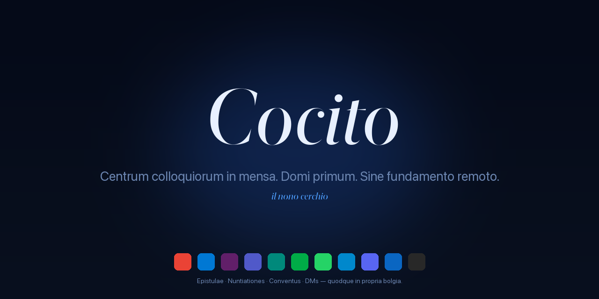

<div align="center">



<sub>
  <a href="README.md">🇵🇹 Português</a> ·
  <a href="README.en.md">🇬🇧 English</a> ·
  <a href="README.es.md">🇪🇸 Español</a> ·
  <a href="README.it.md">🇮🇹 Italiano</a> ·
  <a href="README.fr.md">🇫🇷 Français</a> ·
  <a href="README.de.md">🇩🇪 Deutsch</a> ·
  <a href="README.ru.md">🇷🇺 Русский</a> ·
  🏛️ <strong>Latina</strong>
</sub>

<h3><em>Centrum colloquiorum in mensa. Domi primum. Sine fundamento remoto.</em></h3>

<p>
  <em>Cocytus est nonus circulus Inferni — lacus glaciatus ubi omnes proditores conveniunt. Hic, ubi omnia colloquia conveniunt.</em>
</p>

<p>
  <a href="https://github.com/fagnercandido/cocito/releases/latest"></a>
  <a href="LICENSE"></a>
  
  
</p>

</div>

---

## Quid sit

**Cocytus** est cliens computatralis qui **epistulas electronicas + nuntiationes + conventus** in unum locum coniungit. Quodque servitium in **WebView nativa secreta** currit — auctoritas per interfaciem provisoris, crustula et thesauri numquam transeunt. Sine OAuth ab applicatione regulato, sine APIs, sine nube, sine ratione.

Sententia tribus lineis:

- **Sine fundamento Cocyti.** Quodque *machina* est insula. Sine synchronizatione inter machinas.
- **Sine API epistulari.** Gmail est Gmail intra WebView, cum vera tua sessione.
- **Sine intelligentia artificiali in nube.** Auxiliatrix I.A. (Beatrix) tantum loquitur cum **Ollama domestico** in tua reti privata.

<div align="center">
  
  <br/>
  <sub><em>Latus cum sex servitiis — Gmail (activum), duo Slack secreti, WhatsApp cum xii non lectis, Meet, LinkedIn. Quodque in propria <strong>bolgia</strong>.</em></sub>
</div>

---

## Praecipua

| | |
|---|---|
| 🔒 **Tantum WebView** | Auctoritas in interfacie provisoris, sessio vera. Nullum OAuth ab applicatione regulatum. |
| 🧊 **Bolgiae secretae** | Una `partitio` per instantiam (Malebolge). Slack privatus + Slack laboris simul, **sine contagione**. |
| 🔔 **Nuntii nativi** | Cerberus universaliter Web Notification API intercipit — operatur in Slack, Gmail, WhatsApp, sine DOM scraping. |
| 🎨 **IX themata × II modi × III typographiae** | Quinquaginta quattuor compositiones, omnes in tempore reali, sine renovatione. Stipites Sobria · Litteraria · Nativa, litterae propriae. |
| 🤖 **Beatrix (I.A. domestica)** | `⌘K` ut colloquaris cum tuo Ollama. HTTP fluvius, contextus optionalis ex Virgilio. **Nihil reti privatum exit.** |
| 🔍 **Virgilius** | SQLite + FTS5 super fluvium Cerberi. `⌘⇧F` ad investigationem trans-servitiis. |
| 📝 **Scriptorium → Obsidian** | `⌘⇧S` excerptum · `⌘⇧B` vestigium · `⌘⇧P` tabularium paginae (PDF). Recta in tuum thesaurum. |
| ⚖️ **Minos** | Machina regularum: signa × actiones super fluvium — silentium, prioritas, mutatio thematis, save quote. Hot-reload. |
| 🌐 **i18n · XXVIII linguae** | Babel globaliter applicata. PT, EN, ES, IT, FR, DE, ZH, JA, KO, AR, HI, … |

---

## IX themata

<div align="center">
  
</div>

Quodque respondet ad systematis `prefers-color-scheme`. **Crepusculum** est lucis-primum; cetera sunt obscuritatis-primum; omnia variantem oppositam habent.

---

## Initium velox

### macOS

```bash
# Descripito .dmg ex editione recentissima
open https://github.com/fagnercandido/cocito/releases/latest

# Prima apertio — sine signo nunc, sufficit:
xattr -dr com.apple.quarantine /Applications/Cocito.app
```

### Windows · Linux

`.msi` (Windows x64) et `.AppImage` (Linux x64) advenient cum pipeline editionis perfecta erit. Interim, **aedifica ex fontibus**.

### Aedificatio ex fontibus

```bash
git clone https://github.com/fagnercandido/cocito.git
cd cocito/cocito-tauri
pnpm install
pnpm tauri:dev          # modus evolutionis
pnpm tauri:build        # producit .dmg/.msi/.AppImage secundum hospitem
```

Praerequisita: **Node 20 LTS · pnpm · Rust stabile · Tauri 2 instrumentarium**.

---

## X moduli dantici

Nominatio obligatoria est — quodque membrum nomen incolae Inferni heredat.

| Modulus | Munus | Stratum |
|---|---|---|
| **Caron** | Vita WebView — load, reload, exitus, UA spoofing | Rust + React |
| **Malebolge** | Sessionum secretio, una partitio per servitium/instantiam | Rust |
| **Cerberus** | Spina dorsalis event-driven — `window.Notification` intercipit, ad normam redigit, in via communi publicat | Rust + initium-scriptum |
| **Minos** | Machina regularum — signa × actiones super fluvium | Rust |
| **Virgilius** | SQLite + FTS5 indicator cum palette `⌘⇧F` | Rust (tauri-plugin-sql) |
| **Scriptorium** | Captio `⌘⇧S/B/P` in Obsidian | Rust (fs + print-to-pdf) |
| **Beatrix** | I.A. tegumentum cum Ollama domestico | Rust pons + React |
| **Messo** | Inventio Ollama in reti via mDNS/Bonjour | Rust (tauri-plugin-mdns) |
| **Babel** | i18n in XXVIII linguis | TypeScript |
| **Purgatorium** | Vitest + Playwright | TypeScript |

> **Dantes invisibilis.** Nominatio est structura, sed interfacies silet: nullae flammae, nulli daemones, nullae litterae gothicae. Una imago: lacus glaciatus.

---

## Stipes technicus

- **Tauri 2** + **Rust stabile** (fundamentum)
- **React 18** + **TypeScript 5** + **Vite 5** (frontalis)
- **Tailwind CSS 3** + variabiles CSS (systema picturae IX thematum)
- **Zustand** (status, ~1 KB) · **Lucide React** (imagines) · **Framer Motion** (micro-animationes)
- **WebView nativa systematis**: WebKit (mac), WebView2 (Win), WebKitGTK (Linux)
- **I.A.**: Ollama per HTTP (rete privatum) — `qwen3:32b`, `llama3.2`, quodlibet exemplar domesticum
- **Distributio**: `.dmg` (universale arm64+x86_64), `.msi` x64, `.AppImage` x64. Sine Electron, sine Chromium incluso, sine officinis applicationum.

---

## Philosophia

### Invariantia (sine novo colloquio non negotiari)

1. **Tantum WebView.** Inclusis epistulis. Sine APIs, sine OAuth ab applicatione regulato.
2. **Event-driven per Notification API.** Sine DOM scraping per servitium.
3. **Sine fundamento remoto.** Sine nube, sine ratione, sine synchronizatione contentus.
4. **Domi primum.** Omnia in disco, per machinam.
5. **I.A. tantum Ollama domestica.** Vetatur: OpenAI, Anthropic, Google, Apple Intelligence, BYOK.
6. **Quodque servitium secretum.** Una `partitio` per instantiam — crustula numquam transeunt.
7. **Dantes invisibilis.** Nominatio structuralis, interfacies silens.

### Non-fines

Telephonica · OAuth-fluxus ab applicatione regulati · APIs epistulares (Gmail API, MS Graph, IMAP, SMTP) · Mac App Store · I.A. in nube · Synchronizatio contentus in nube · Indexatio colloquiorum silentium (sine nuntio → sine fluvio — hoc est *bonum*).

---

## Iter futurum

- [x] **MVP** · structura + IX themata + latus drag-drop + Malebolge + Cerberus + Minos + Scriptorium + Virgilius
- [x] **v1.1** · Beatrix (Ollama fluvius) · Messo (mDNS) · palette `⌘⇧F` · parser packs · i18n · Cerberus v2
- [x] **v1.2** · tray signum non-lectorum · status loading · synchronizationis structura
- [x] **v0.3** · SQLCipher opt-in · clavium · A11y · audit log · auto-renovatio
- [ ] **v1.3** · signum codicis + notarizatio Apple Developer ID
- [ ] **v1.4** · aedificationes Windows/Linux per GitHub Actions
- [ ] **v1.5** · Scriptorium PDF silens per CDP (exspectat upstream `wry` PR)
- [ ] **v2.0** · synchronizationis transportus verus (Syncthing-side · P2P+Automerge · Iroh — in deliberatione)

---

## Contributio

Issues et PRs grati. Antequam incipias:

1. Lege [`cocito-revival-plan.md`](cocito-revival-plan.md) — documentum canonicum est.
2. Moduli **nominationem obligatoriam** habent (Caron, Cerberus, Virgilius…). Si munus mutas, nomen retine.
3. **Invariantia architectonica** defendenda sunt, non in PRs avulsis discutienda. Si dissentis, aperi *design* issue.
4. **Probationes**: `pnpm test` (Vitest) et `cargo test --manifest-path src-tauri/Cargo.toml` ante submissionem.
5. **Stilus commitendi**: imperativus brevis lusitanice vel anglice, sine emoji in nuntio.

---

## Securitas

Mendum securitatis? Vide [`SECURITY.md`](SECURITY.md) ad aptum canalem. **Non aperias** issue publicum donec emendatio adest.

---

## Licentia

[MIT](LICENSE) · © MMXXVI Fagner Cândido

<div align="center">
  <sub>
    <a href="https://github.com/fagnercandido">GitHub</a> ·
    <a href="https://pt.linkedin.com/in/fagner-souza-candido">LinkedIn</a>
  </sub>
</div>
