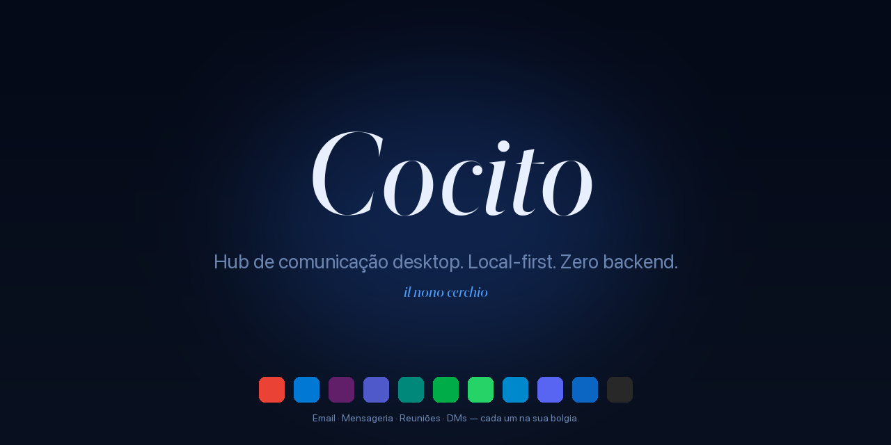
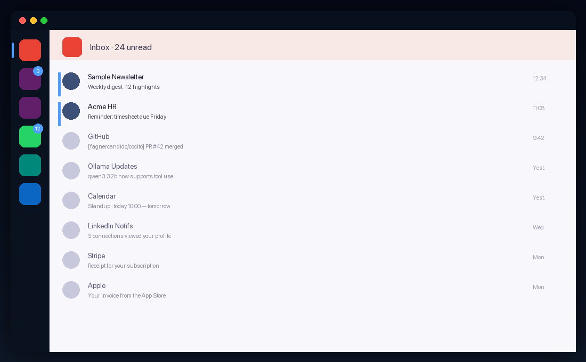
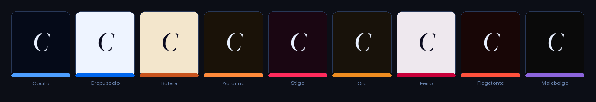

<div align="center">



<sub>
  🇵🇹 <strong>Português</strong> ·
  <a href="README.en.md">🇬🇧 English</a> ·
  <a href="README.es.md">🇪🇸 Español</a> ·
  <a href="README.it.md">🇮🇹 Italiano</a> ·
  <a href="README.fr.md">🇫🇷 Français</a> ·
  <a href="README.de.md">🇩🇪 Deutsch</a> ·
  <a href="README.ru.md">🇷🇺 Русский</a> ·
  <a href="README.la.md">🏛️ Latina</a>
</sub>

<h3><em>Hub de comunicação desktop. Local-first. Zero backend.</em></h3>

<p>
  <em>Cocito è il nono cerchio dell'Inferno — il lago ghiacciato dove convergono tutti i traditori. Aqui, dove convergem todas as conversas.</em>
</p>

<p>
  <a href="https://github.com/fagnercandido/cocito/releases/latest"></a>
  <a href="LICENSE"></a>
  
  
</p>

</div>

---

## O que é

**Cocito** é um cliente desktop que junta **email + mensageria + reuniões** num só sítio. Cada serviço corre numa **WebView nativa isolada** — login pela UI do provider, cookies e storage nunca cruzam. Sem OAuth gerido pela app, sem APIs, sem cloud, sem conta.

A ideia em três linhas:

- **Não há backend Cocito.** Cada *device* é uma ilha. Sem sincronização entre máquinas.
- **Não há email API.** O Gmail é o Gmail dentro da WebView, com a tua sessão real.
- **Não há AI cloud.** A AI assistente (Beatriz) só fala com **Ollama local** na tua LAN.

<div align="center">
  
  <br/>
  <sub><em>Sidebar com 6 serviços — Gmail (ativo), dois Slacks isolados, WhatsApp com 12 unreads, Meet, LinkedIn. Cada um numa <strong>bolgia</strong> independente.</em></sub>
</div>

---

## Highlights

| | |
|---|---|
| 🔒 **WebView-only** | Login na UI do provider, sessão real. Zero OAuth gerido pela app. |
| 🧊 **Bolgias isoladas** | Uma `partition` por instância (Malebolge). Slack pessoal + Slack do trabalho lado-a-lado, **zero contaminação**. |
| 🔔 **Notifs nativas** | Cérbero intercepta a Web Notification API universalmente — funciona no Slack, Gmail, WhatsApp, sem scrape de DOM. |
| 🎨 **9 temas × 2 modos × 3 tipografias** | 54 combinações, todas em tempo real, zero reload. Tipografia Sóbria · Literária · Nativa, fontes self-hosted. |
| 🤖 **Beatriz (AI local)** | `⌘K` para conversar com o teu Ollama. Stream HTTP, contexto opcional do Virgílio. **Nada sai da LAN.** |
| 🔍 **Virgílio** | SQLite + FTS5 sobre o stream do Cérbero. `⌘⇧F` para pesquisa cross-service. |
| 📝 **Scriptorium → Obsidian** | `⌘⇧S` quote · `⌘⇧B` breadcrumb · `⌘⇧P` page archive (PDF). Direto para o teu vault. |
| ⚖️ **Minos** | Rule engine: gatilhos × ações sobre o stream — silence, priority, theme switch, save quote. Hot-reload. |
| 🌐 **i18n · 28 idiomas** | Babele aplicado globalmente. PT-PT, PT-BR, EN, ES, IT, FR, DE, ZH, JA, KO, AR, HI, … |

---

## Os 9 temas

<div align="center">
  
</div>

Cada um responde a `prefers-color-scheme` do sistema. **Crepúsculo** é light-first; os restantes são dark-first; todos têm a sua variante oposta.

---

## Quick start

### macOS

```bash
# Faz download do .dmg da última release
open https://github.com/fagnercandido/cocito/releases/latest

# Primeira abertura — não-assinado por agora, basta:
xattr -dr com.apple.quarantine /Applications/Cocito.app
```

### Windows · Linux

`.msi` (Windows x64) e `.AppImage` (Linux x64) chegam quando o pipeline de release fechar. Por enquanto, **build a partir do source**.

### Build a partir do source

```bash
git clone https://github.com/fagnercandido/cocito.git
cd cocito/cocito-tauri
pnpm install
pnpm tauri:dev          # arranca em modo dev
pnpm tauri:build        # produz .dmg/.msi/.AppImage conforme o host
```

Pré-requisitos: **Node 20 LTS · pnpm · Rust stable · Tauri 2 toolchain**.

---

## Os 10 módulos dantescos

A nomenclatura é vinculativa — cada peça herda o nome de um habitante do Inferno.

| Módulo | Função | Camada |
|---|---|---|
| **Caronte** | Lifecycle das WebViews — load, reload, logout, UA spoofing | Rust + React |
| **Malebolge** | Isolamento de sessions, uma partition por serviço/instância | Rust |
| **Cérbero** | Backbone event-driven — intercepta `window.Notification`, normaliza, publica no bus | Rust + init-script |
| **Minos** | Rule engine — gatilhos × ações sobre o stream | Rust |
| **Virgílio** | Indexador SQLite + FTS5 com palette `⌘⇧F` | Rust (tauri-plugin-sql) |
| **Scriptorium** | Captura `⌘⇧S/B/P` para Obsidian | Rust (fs + print-to-pdf) |
| **Beatriz** | AI overlay com Ollama local | Rust bridge + React |
| **Messo** | Discovery do Ollama na LAN via mDNS/Bonjour | Rust (tauri-plugin-mdns) |
| **Babele** | i18n em 28 idiomas | TypeScript |
| **Purgatorio** | Vitest + Playwright | TypeScript |

> **Dante invisível.** O nome é a estrutura, mas a UI é silenciosa: sem chamas, sem demónios, sem tipografia gótica. O ícone único é um lago gelado.

---

## Stack

- **Tauri 2** + **Rust stable** (backend)
- **React 18** + **TypeScript 5** + **Vite 5** (frontend)
- **Tailwind CSS 3** + CSS variables (design system dos 9 temas)
- **Zustand** (state, ~1 KB) · **Lucide React** (ícones) · **Framer Motion** (micro-animações)
- **WebView nativa do SO**: WebKit (mac), WebView2 (Win), WebKitGTK (Linux)
- **AI**: Ollama via HTTP (LAN) — `qwen3:32b`, `llama3.2`, qualquer modelo local
- **Distribuição**: `.dmg` (universal arm64+x86_64), `.msi` x64, `.AppImage` x64. Zero Electron, zero Chromium empacotado, zero app stores.

---

## Estrutura do repositório

```
cocito/
├── README.md                    ← este ficheiro
├── LICENSE                      ← MIT
├── SECURITY.md                  ← política de segurança
├── cocito-revival-plan.md       ← plano canónico (visão completa)
└── cocito-tauri/                ← a app
    ├── src-tauri/               ← Rust
    │   └── src/modules/         ← caronte · malebolge · cerbero · minos · virgilio · scriptorium · beatriz · messo
    ├── src/                     ← React
    │   ├── components/  themes/  typography/  fonts/  stores/  parsers/  locales/
    ├── init-scripts/            ← notification-intercept.js (universal, injetado em cada WebView)
    ├── services.json            ← catálogo de serviços
    └── scripts/                 ← release.sh, sign-and-notarize.sh, build-icon.py, build-readme-assets.py
```

Em runtime, tudo fica em `~/Library/Application Support/Cocito/` (mac), `%APPDATA%\Cocito\` (Win), `~/.config/Cocito/` (Linux).

---

## Filosofia

### Invariantes (não negociar sem nova discussão)

1. **WebView-only.** Email incluído. Sem APIs, sem OAuth gerido pela app.
2. **Event-driven via Notification API interception.** Sem DOM scraping per-service.
3. **Zero backend.** Sem cloud, sem conta, sem sync de conteúdo.
4. **Local-first.** Tudo em disco, por *device*.
5. **AI só Ollama local.** Proibido OpenAI, Anthropic, Google, Apple Intelligence, BYOK.
6. **Cada serviço isolado.** Uma `partition` por instância — cookies nunca cruzados.
7. **Dante invisível.** O nome é estrutural, a UI é silenciosa.

### Non-goals

Mobile · OAuth flows geridos pela app · Email APIs (Gmail API, MS Graph, IMAP, SMTP) · Mac App Store (sandbox bloqueia partitions custom) · AI cloud · Cloud sync de conteúdo · Indexar conversas silenciosas (sem notif → sem stream — é *feature*).

---

## Roadmap

- [x] **MVP** · scaffold + 9 temas + sidebar drag-drop + Malebolge + Cérbero + Minos + Scriptorium + Virgílio
- [x] **v1.1** · Beatriz (Ollama streaming) · Messo (mDNS) · palette `⌘⇧F` · parser packs · i18n · Cérbero v2
- [x] **v1.2** · tray badge unreads · loading state · sync skeleton
- [x] **v0.3** · SQLCipher opt-in · keychain · A11y · audit log · auto-update
- [ ] **v1.3** · code signing + notarization Apple Developer ID
- [ ] **v1.4** · builds Windows/Linux via GitHub Actions
- [ ] **v1.5** · Scriptorium PDF silencioso via CDP (espera PR upstream `wry`)
- [ ] **v2.0** · sync transport real (Syncthing-side · P2P+Automerge · Iroh — em decisão)

---

## Contributing

Issues e PRs bem-vindos. Antes de começar:

1. Lê o [`cocito-revival-plan.md`](cocito-revival-plan.md) — é o documento canónico.
2. Os módulos têm **nomenclatura vinculativa** (Caronte, Cérbero, Virgílio…). Se mexes na função, mantém o nome.
3. Os **invariantes arquiteturais** são para defender, não para discutir em PRs avulso. Se discordas de algum, abre uma issue de *design*.
4. **Testes**: `pnpm test` (Vitest) e `cargo test --manifest-path src-tauri/Cargo.toml` antes de submeter.
5. **Estilo de commit**: imperativo curto em PT-PT ou EN, sem emojis na mensagem.

---

## Segurança

Bug de segurança? Vê [`SECURITY.md`](SECURITY.md) para o canal apropriado. **Não** abras issue público até haver patch.

---

## Licença

[MIT](LICENSE) · © 2026 Fagner Cândido

<div align="center">
  <sub>
    <a href="https://github.com/fagnercandido">GitHub</a> ·
    <a href="https://pt.linkedin.com/in/fagner-souza-candido">LinkedIn</a>
  </sub>
</div>
