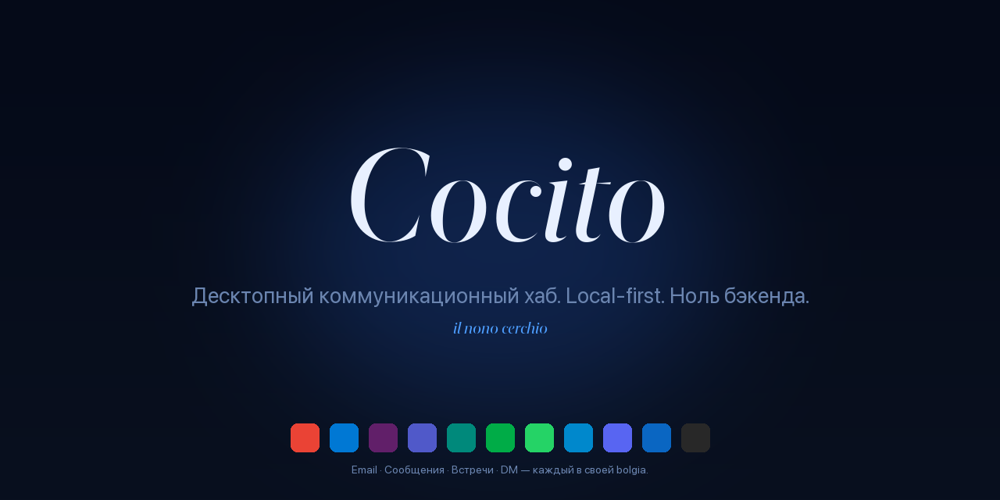

<div align="center">



<sub>
  <a href="README.md">🇵🇹 Português</a> ·
  <a href="README.en.md">🇬🇧 English</a> ·
  <a href="README.es.md">🇪🇸 Español</a> ·
  <a href="README.it.md">🇮🇹 Italiano</a> ·
  <a href="README.fr.md">🇫🇷 Français</a> ·
  <a href="README.de.md">🇩🇪 Deutsch</a> ·
  🇷🇺 <strong>Русский</strong> ·
  <a href="README.la.md">🏛️ Latina</a>
</sub>

<h3><em>Десктопный коммуникационный хаб. Local-first. Ноль бэкенда.</em></h3>

<p>
  <em>Cocito è il nono cerchio dell'Inferno — замёрзшее озеро, где сходятся все предатели. Здесь, где сходятся все разговоры.</em>
</p>

<p>
  <a href="https://github.com/fagnercandido/cocito/releases/latest"></a>
  <a href="LICENSE"></a>
  
  
</p>

</div>

---

## Что это

**Cocito** — это десктопный клиент, объединяющий **почту + мессенджеры + видеовстречи** в одном месте. Каждый сервис работает в **изолированном нативном WebView** — авторизация через UI провайдера, cookies и хранилище никогда не пересекаются. Никакого OAuth, управляемого приложением, никаких API, никакого облака, никакого аккаунта.

Идея в трёх строках:

- **У Cocito нет бэкенда.** Каждое *устройство* — остров. Никакой синхронизации между машинами.
- **Никаких email API.** Gmail — это Gmail внутри WebView, с твоей реальной сессией.
- **Никакого облачного ИИ.** ИИ-ассистент (Beatriz) общается только с **локальным Ollama** в твоей LAN.

<div align="center">
  
  <br/>
  <sub><em>Боковая панель с 6 сервисами — Gmail (активный), два изолированных Slack, WhatsApp с 12 непрочитанными, Meet, LinkedIn. Каждый в своей <strong>bolgia</strong>.</em></sub>
</div>

---

## Особенности

| | |
|---|---|
| 🔒 **Только WebView** | Авторизация в UI провайдера, реальная сессия. Ноль OAuth, управляемого приложением. |
| 🧊 **Изолированные bolgia** | Один `partition` на инстанс (Malebolge). Личный Slack + рабочий Slack бок о бок, **ноль контаминации**. |
| 🔔 **Нативные уведомления** | Cérbero универсально перехватывает Web Notification API — работает в Slack, Gmail, WhatsApp без DOM scraping. |
| 🎨 **9 тем × 2 режима × 3 типографики** | 54 комбинации, все в реальном времени, ноль перезагрузок. Стеки Sobria · Literaria · Nativa, self-hosted шрифты. |
| 🤖 **Beatriz (локальный ИИ)** | `⌘K` для общения с твоим Ollama. HTTP стриминг, опциональный контекст из Virgílio. **Ничего не покидает LAN.** |
| 🔍 **Virgílio** | SQLite + FTS5 над потоком Cérbero. `⌘⇧F` для кросс-сервисного поиска. |
| 📝 **Scriptorium → Obsidian** | `⌘⇧S` цитата · `⌘⇧B` breadcrumb · `⌘⇧P` архив страницы (PDF). Прямо в твой vault. |
| ⚖️ **Minos** | Движок правил: триггеры × действия над потоком — silence, priority, смена темы, save quote. Hot-reload. |
| 🌐 **i18n · 28 языков** | Babele применяется глобально. PT, EN, ES, IT, FR, DE, ZH, JA, KO, AR, HI, … |

---

## 9 тем

<div align="center">
  
</div>

Каждая отвечает на системное `prefers-color-scheme`. **Crepuscolo** — light-first; остальные — dark-first; у всех есть противоположный вариант.

---

## Быстрый старт

### macOS

```bash
# Скачай .dmg последнего релиза
open https://github.com/fagnercandido/cocito/releases/latest

# Первое открытие — пока без подписи, достаточно:
xattr -dr com.apple.quarantine /Applications/Cocito.app
```

### Windows · Linux

`.msi` (Windows x64) и `.AppImage` (Linux x64) появятся, когда release pipeline будет настроен. Пока — **сборка из исходников**.

### Сборка из исходников

```bash
git clone https://github.com/fagnercandido/cocito.git
cd cocito/cocito-tauri
pnpm install
pnpm tauri:dev          # режим разработки
pnpm tauri:build        # производит .dmg/.msi/.AppImage в зависимости от хоста
```

Требования: **Node 20 LTS · pnpm · Rust stable · Tauri 2 toolchain**.

---

## 10 дантовских модулей

Именование обязательно — каждая часть наследует имя обитателя Ада.

| Модуль | Функция | Слой |
|---|---|---|
| **Caronte** | Жизненный цикл WebView — load, reload, logout, UA spoofing | Rust + React |
| **Malebolge** | Изоляция сессий, один partition на сервис/инстанс | Rust |
| **Cérbero** | Event-driven backbone — перехватывает `window.Notification`, нормализует, публикует в шину | Rust + init-script |
| **Minos** | Движок правил — триггеры × действия над потоком | Rust |
| **Virgílio** | SQLite + FTS5 индексатор с палитрой `⌘⇧F` | Rust (tauri-plugin-sql) |
| **Scriptorium** | Захват `⌘⇧S/B/P` в Obsidian | Rust (fs + print-to-pdf) |
| **Beatriz** | ИИ overlay с локальным Ollama | Rust bridge + React |
| **Messo** | Discovery Ollama в LAN через mDNS/Bonjour | Rust (tauri-plugin-mdns) |
| **Babele** | i18n на 28 языках | TypeScript |
| **Purgatorio** | Vitest + Playwright | TypeScript |

> **Невидимый Данте.** Имя — это структура, но UI безмолвен: ни пламени, ни демонов, ни готической типографики. Единственная иконка — замёрзшее озеро.

---

## Стек

- **Tauri 2** + **Rust stable** (бэкенд)
- **React 18** + **TypeScript 5** + **Vite 5** (фронтенд)
- **Tailwind CSS 3** + CSS-переменные (дизайн-система 9 тем)
- **Zustand** (state, ~1 KB) · **Lucide React** (иконки) · **Framer Motion** (микроанимации)
- **Нативный WebView ОС**: WebKit (mac), WebView2 (Win), WebKitGTK (Linux)
- **ИИ**: Ollama через HTTP (LAN) — `qwen3:32b`, `llama3.2`, любая локальная модель
- **Дистрибуция**: `.dmg` (универсальный arm64+x86_64), `.msi` x64, `.AppImage` x64. Ноль Electron, ноль bundled Chromium, ноль app stores.

---

## Философия

### Инварианты (не обсуждать без нового разговора)

1. **Только WebView.** Включая email. Никаких API, никакого OAuth, управляемого приложением.
2. **Event-driven через Notification API.** Никакого DOM scraping по сервисам.
3. **Ноль бэкенда.** Никакого облака, никакого аккаунта, никакой синхронизации контента.
4. **Local-first.** Всё на диске, по устройству.
5. **ИИ только локальный Ollama.** Запрещено: OpenAI, Anthropic, Google, Apple Intelligence, BYOK.
6. **Каждый сервис изолирован.** Один `partition` на инстанс — cookies никогда не пересекаются.
7. **Невидимый Данте.** Имя структурно, UI безмолвен.

### Non-goals

Мобильные платформы · OAuth-флоу, управляемые приложением · Email API (Gmail API, MS Graph, IMAP, SMTP) · Mac App Store · Облачный ИИ · Облачная синхронизация контента · Индексация молчаливых разговоров (нет уведомления → нет потока — это *фича*).

---

## Roadmap

- [x] **MVP** · scaffold + 9 тем + drag-drop sidebar + Malebolge + Cérbero + Minos + Scriptorium + Virgílio
- [x] **v1.1** · Beatriz (Ollama стриминг) · Messo (mDNS) · палитра `⌘⇧F` · parser packs · i18n · Cérbero v2
- [x] **v1.2** · tray badge непрочитанных · loading state · sync skeleton
- [x] **v0.3** · SQLCipher opt-in · keychain · A11y · audit log · auto-update
- [ ] **v1.3** · code signing + нотаризация Apple Developer ID
- [ ] **v1.4** · сборки Windows/Linux через GitHub Actions
- [ ] **v1.5** · тихий Scriptorium PDF через CDP (ждёт upstream `wry` PR)
- [ ] **v2.0** · реальный sync transport (Syncthing-side · P2P+Automerge · Iroh — в обсуждении)

---

## Контрибуции

Issues и PR приветствуются. Перед началом:

1. Прочитай [`cocito-revival-plan.md`](cocito-revival-plan.md) — это канонический документ.
2. У модулей **обязательное именование** (Caronte, Cérbero, Virgílio…). Если меняешь функцию, сохрани имя.
3. **Архитектурные инварианты** защищаются, а не обсуждаются в случайных PR. Если не согласен — открой *design* issue.
4. **Тесты**: `pnpm test` (Vitest) и `cargo test --manifest-path src-tauri/Cargo.toml` перед отправкой.
5. **Стиль коммитов**: короткий императив на PT-PT или EN, без эмодзи в сообщении.

---

## Безопасность

Баг безопасности? Смотри [`SECURITY.md`](SECURITY.md) для правильного канала. **Не открывай** публичный issue до появления патча.

---

## Лицензия

[MIT](LICENSE) · © 2026 Fagner Cândido

<div align="center">
  <sub>
    <a href="https://github.com/fagnercandido">GitHub</a> ·
    <a href="https://pt.linkedin.com/in/fagner-souza-candido">LinkedIn</a>
  </sub>
</div>
